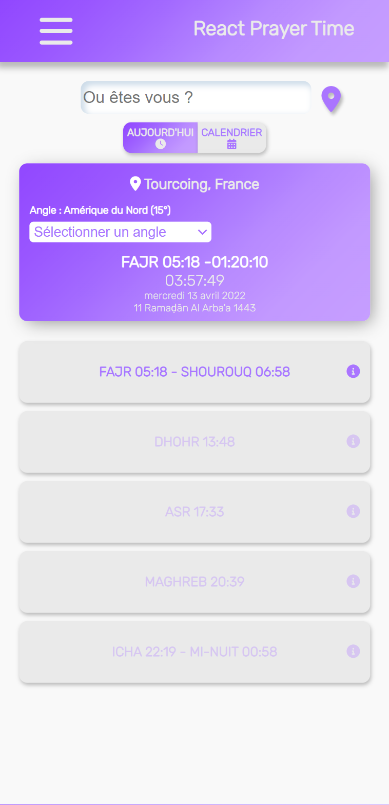
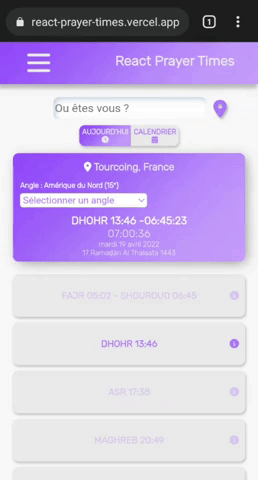
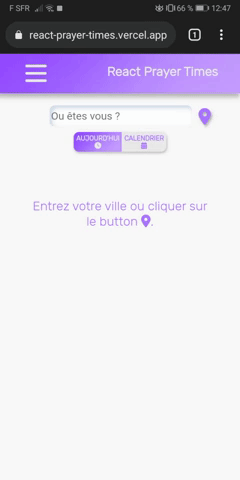
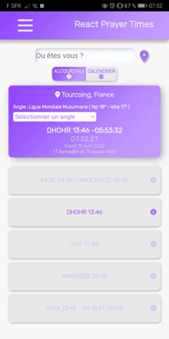
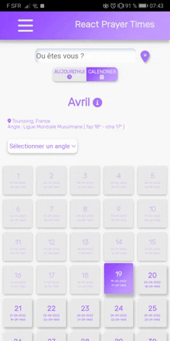
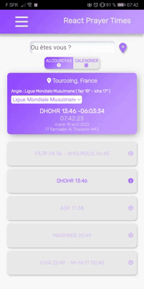

# React Prayer Times

Application web progressive d'horaires de prières développer avec React JS, utilisation des Service Worker, Web Worker, et plusieurs API.

## Fonctionalités

- Changer l'angle de prières

- Mode hors ligne

- Instalation
  

- Localisation
  

- Recherche par ville et par pays
  

- Avoir les horaires du jour
  

- Avoir les horaires du mois
  

- Timer montrant le temps limite de prières

- Lecture du Coran et de la traduction française
  
